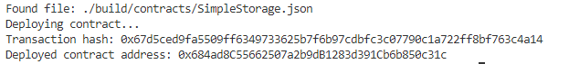

# 1. Screenshot of the console output immediately after you have successfully deployed a smart contract 

# 2. Transaction hash from the contract deployment 
0x67d5ced9fa5509ff6349733625b7f6b97cdbfc3c07790c1a722ff8bf763c4a14

# 3. Deployed contract address from the contract deployment 
0x684ad8C55662507a2b9dB1283d391Cb6b850c31c
