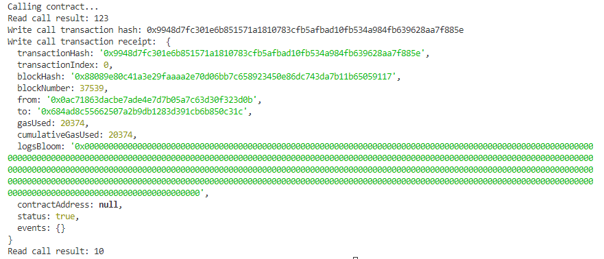

# Task 3 ( A Smart Contract Call To The Deployed Smart Contract)

1. A screenshot of the console output immediately after you have successfully issued a smart contract call.



2. The transaction hash from the console output (in text format).

   `0x9948d7fc301e6b851571a1810783cfb5afbad10fb534a984fb639628aa7f885e`

3. The contract address that you called (in text format).

   `0x684ad8C55662507a2b9dB1283d391Cb6b850c31c`

4. The ABI for contract you made a call on (in text format).

```
  [
    {
        "inputs": [],
        "stateMutability": "payable",
        "type": "constructor"
    },
    {
        "inputs": [
            {
                "internalType": "uint256",
                "name": "x",
                "type": "uint256"
            }
        ],
        "name": "set",
        "outputs": [],
        "stateMutability": "payable",
        "type": "function"
    },
    {
        "inputs": [],
        "name": "get",
        "outputs": [
            {
                "internalType": "uint256",
                "name": "",
                "type": "uint256"
            }
        ],
        "stateMutability": "view",
        "type": "function"
    }
 ]
```
