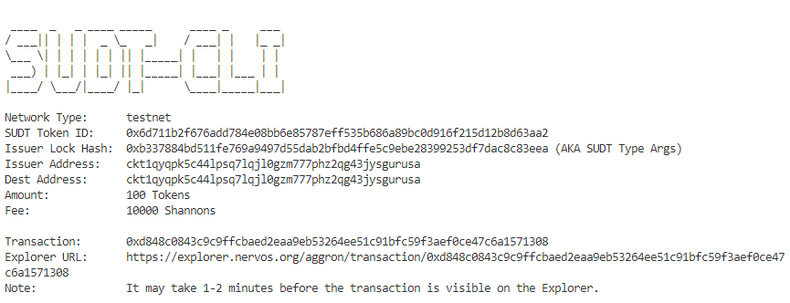
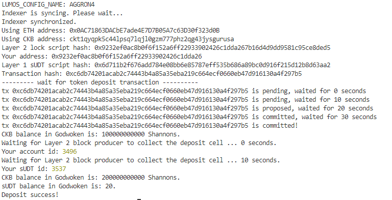

# Gitcoin: 4) Issue an SUDT Token on Layer 1 and Deposit it to Layer 2

## A link to the Layer 1 address you funded on the Testnet Explorer.
https://explorer.nervos.org/aggron/transaction/0xd848c0843c9c9ffcbaed2eaa9eb53264ee51c91bfc59f3aef0ce47c6a1571308

### 2. create your SUDT tokens on Layer 1

### 3.Deposit to Layer 2

### 4.SUDT ID : 3537
